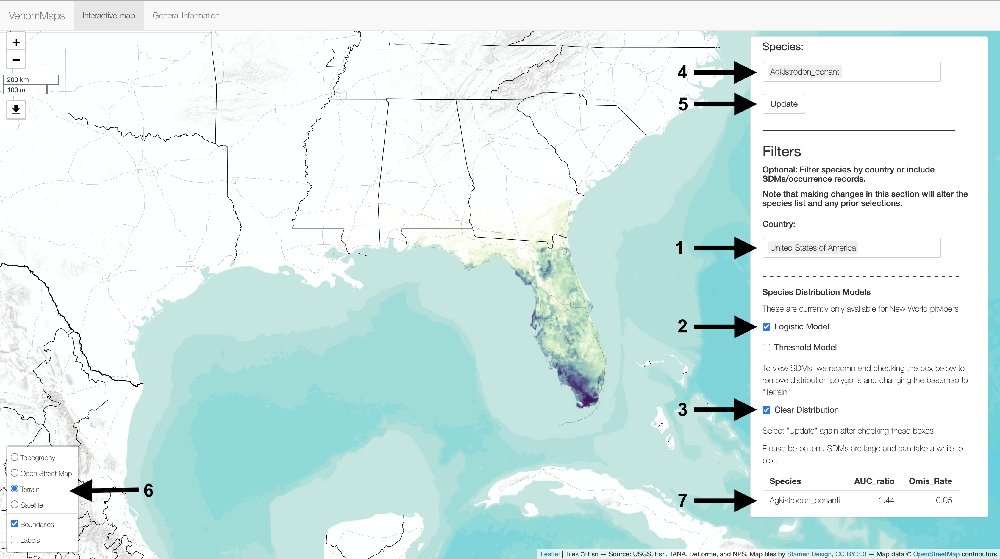
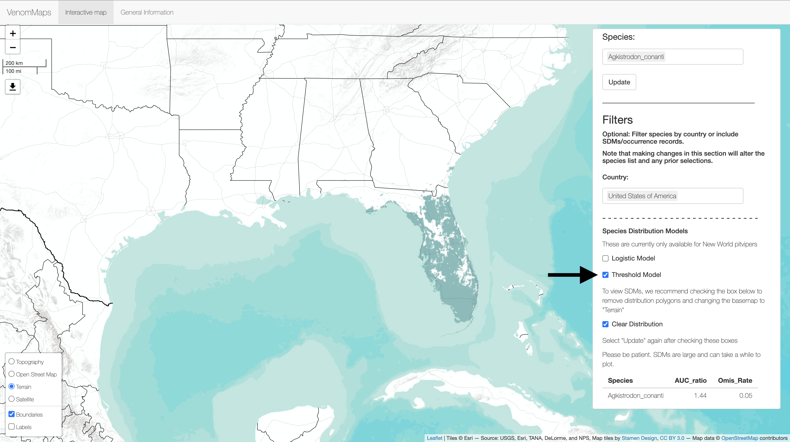

# VenomMaps: Updated Species Distribution Maps and Models for New World Pitvipers (Crotalinae)


### Rhett M. Rautsaw, Gustavo Jiménez-Velázquez, Erich P. Hofmann, Laura R. V. Alencar, Christoph I. Grünwald, Marcio Martins, Paola Carrasco, Tiffany M. Doan, & Christopher L. Parkinson

<br>

[](https://rhettrautsaw.app/shiny/VenomMaps){target="blank"}
[](https://doi.org/10.1038/s41597-022-01323-4){target="blank"}
[](https://creativecommons.org/licenses/by/4.0/){target="blank"}
[](https://doi.org/10.5281/zenodo.5637094){target="blank"}

# Table of Contents

- Cleaned occurrence records for Viperidae from [GBIF](https://www.gbif.org/){target="blank"}, [HerpMapper](https://www.herpmapper.org/){target="blank"}, [Bison](https://bison.usgs.gov/){target="blank"}, [Brazil Snake Atlas](https://bioone.org/journals/South-American-Journal-of-Herpetology/volume-14/issue-sp1/SAJH-D-19-00120.1/Atlas-of-Brazilian-Snakes--Verified-Point-Locality-Maps-to/10.2994/SAJH-D-19-00120.1.short){target="blank"}, [BioWeb Ecuador](https://bioweb.bio/){target="blank"}, and custom databases/georeferencing. 
  - [`data/occurrence`](https://github.com/RhettRautsaw/VenomMaps/tree/master/data/occurrence)
- Updated distribution maps in `geojson` format for all New World Pitvipers as well as distribution maps for Old World Vipers from [Roll et al. 2017](https://www.nature.com/articles/s41559-017-0332-2){target="blank"}.
  - [`data/distributions`](https://github.com/RhettRautsaw/VenomMaps/tree/master/data/distributions)
- Final species distribution models for all New World pitvipers
  - [`data/sdms`](https://github.com/RhettRautsaw/VenomMaps/tree/master/data/sdms)
- Code used to clean occurrence records, construct distribution maps, and summarize sdm results.
  - [`code/*`](https://github.com/RhettRautsaw/VenomMaps/tree/master/code)
- Code used to construct species distribution models
  - [`code/autokuenm/*`](https://github.com/RhettRautsaw/VenomMaps/tree/master/code/autokuenm)
- Shiny App to visualize results
  - [`app.R`](https://RhettRautsaw.app/shiny/VenomMaps/)
  - User Guide found below


# Shiny App

You can view the VenomMaps Shiny App for free on my Digital Ocean Droplet: 
[RhettRautsaw.app/shiny/VenomMaps](https://RhettRautsaw.app/shiny/VenomMaps/){target="blank"}

## User Guide

After opening the app you should be greeted with the following page:


<br>

*** 

<br>

Next, (1) enter a **Species** into the box on the right and (2) hit **Update** to plot the distribution. 
Multiple species can be input at once! 


<br>

*** 

<br>

You can filter the list of species in the **Species** box by country and available SDMs. 
For example, (1) entering "United States of America" in the **Country** box and 
(2) checking the box for the **Logistic Model** will filter the (4) **Species** box to only show species that fit these criteria. 

If you only want to view the SDM rather than the distribution polygon + SDM, you can (3) check the **Clear Distribution** box.
Remember to (5) **Update** to make the changes. 

Please note that SDMs are large and take a long time to plot. Please be patient. Alternatively, you can download this repository and run the Shiny App locally for faster plotting (see below). 

The box in the lower left corner (6) has alternate basemaps on which to view the data. 
We recommend changing to the "Terrain" map to view SDMs. 

Lastly, a table with SDM statistics (7) will continuously update based on the (4) **Species** selected.



<br>

*** 

<br>

You can also plot the 10th percentile training threshold models and although it is not shown, you can also add **Occurrence Records**.



<br>

*** 

<br>

You can download the distribution map using the **Download Shapefile** option. There is also a second tab at the top of the page (**General Information**) which will give you some more information such as the common name, tell you when the species was described, subspecies, and the maximum length for the species compared to all other viper species:


<br>

*** 

<br>

## Running the Application Locally

This app can also be run through R:

```R
library(shiny)

# Easiest way is to use runGitHub
runGitHub("VenomMaps", "RhettRautsaw")

# Run a tar or zip file directly
runUrl("https://github.com/RhettRautsaw/VenomMaps/archive/master.tar.gz")
runUrl("https://github.com/RhettRautsaw/VenomMaps/archive/master.zip")
```

To run a Shiny app from a subdirectory in the repo or zip file, you can use the `subdir` argument. This repository happens to contain another copy of the app in `inst/shinyapp/`.

```R
runGitHub("VenomMaps", "RhettRautsaw", subdir = "inst/shinyapp/")

runUrl("https://github.com/RhettRautsaw/VenomMaps/archive/master.tar.gz",
  subdir = "inst/shinyapp/")
```

## Download the Data

You can clone this GitHub repository to run the Shiny App or to download all the `geojson` files.

```R
# First clone the repository with git. If you have cloned it into
# ~/VenomMaps, first go to that directory, then use runApp().
setwd("~/VenomMaps")
runApp()
```

# Todo List (Additions)

- Update distribution maps for Old World Vipers and other venomous snake species.
- Add phylogeographic tracing/playback
- Venom Information
- Diet Information