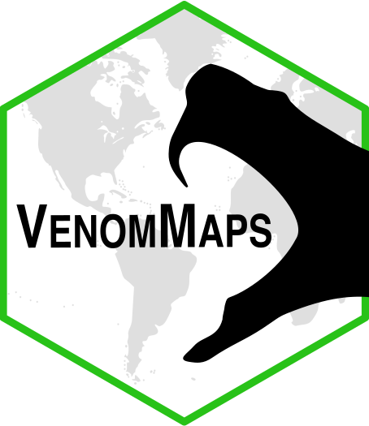

# VenomMaps


## Rhett M. Rautsaw

This repository is private, but contains the underlying code and data for the **VenomMaps** Shiny application hosted at 
[RhettRautsaw.com/shiny/VenomMaps](https://RhettRautsaw.com/shiny/VenomMaps/)

This repository contains:

- Updated distribution maps in `geojson` format for all New World Pitvipers
- Information on the taxonomic citations, size, and subspecies for each species

TO DO:

- Update distribution maps for Old World Pitvipers and True Vipers
- Add phylogeographic tracing
- Venom
- Diet

## Running the Application Locally

It is hosted freely on my Digital Ocean Droplet: 
[RhettRautsaw.com/shiny/VenomMaps](https://RhettRautsaw.com/shiny/VenomMaps/)

This app can also be run through R:

```R
library(shiny)

# Easiest way is to use runGitHub
runGitHub("VenomMaps", "RhettRautsaw")

# Run a tar or zip file directly
runUrl("https://github.com/RhettRautsaw/VenomMaps/archive/master.tar.gz")
runUrl("https://github.com/RhettRautsaw/VenomMaps/archive/master.zip")
```

To run a Shiny app from a subdirectory in the repo or zip file, you can use the `subdir` argument. This repository happens to contain another copy of the app in `inst/shinyapp/`.

```R
runGitHub("VenomMaps", "RhettRautsaw", subdir = "inst/shinyapp/")

runUrl("https://github.com/RhettRautsaw/VenomMaps/archive/master.tar.gz",
  subdir = "inst/shinyapp/")
```

## Download the Data

You can clone this GitHub repository to run the Shiny App or to download all the `geojson` files.

```R
# First clone the repository with git. If you have cloned it into
# ~/VenomMaps, first go to that directory, then use runApp().
setwd("~/VenomMaps")
runApp()
```
