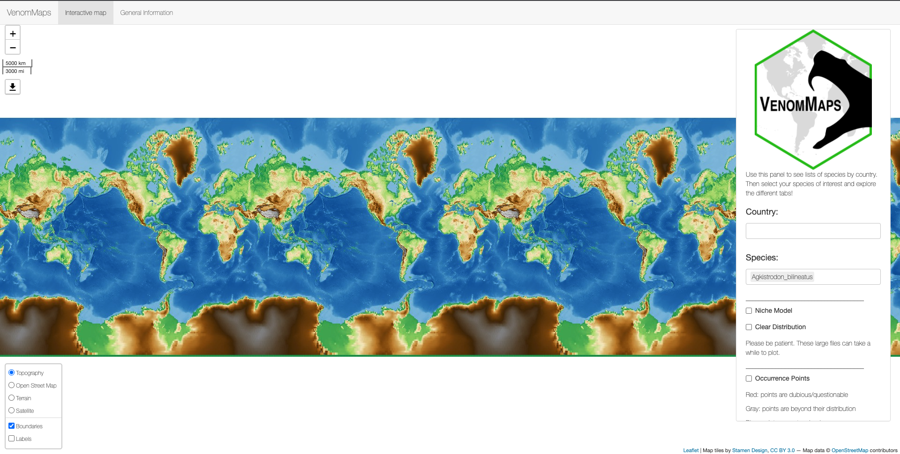
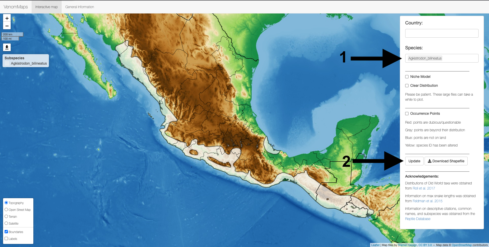
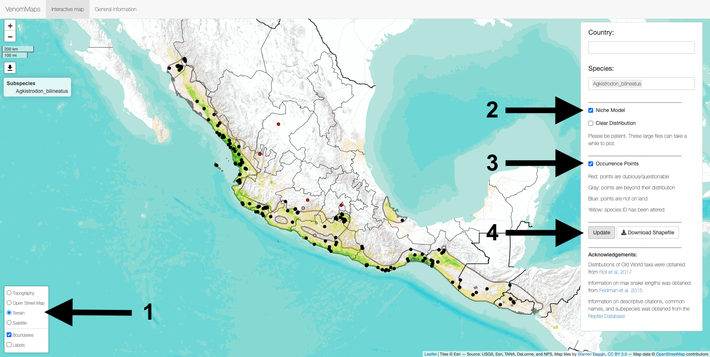
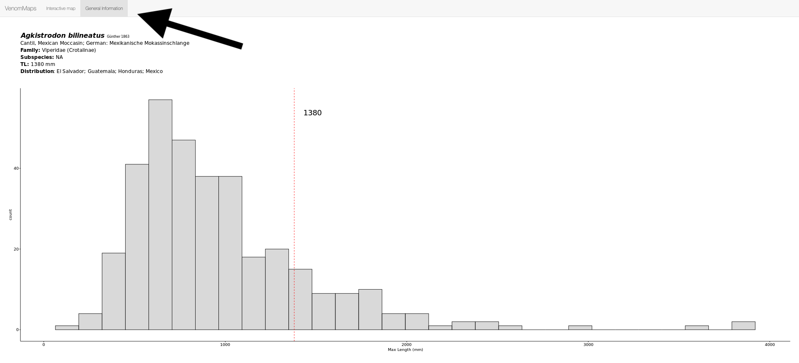

# VenomMaps: Updated Distribution Maps and Niche Models for New World Pitvipers (Crotalinae)


### Rhett M. Rautsaw, Gustavo Jiménez-Velázquez, Erich P. Hofmann, Laura Alencar, Christoph I. Grünwald, Marcio Martins, Paola Carrasco, Tiffany Doan, & Christopher L. Parkinson

# Table of Contents

- Cleaned occurrence records for Viperidae from [GBIF](https://www.gbif.org/), [HerpMapper](https://www.herpmapper.org/), [Bison](https://bison.usgs.gov/), [Brazil Snake Atlas](https://bioone.org/journals/South-American-Journal-of-Herpetology/volume-14/issue-sp1/SAJH-D-19-00120.1/Atlas-of-Brazilian-Snakes--Verified-Point-Locality-Maps-to/10.2994/SAJH-D-19-00120.1.short), [BioWeb Ecuador](https://bioweb.bio/), and custom databases/georeferencing. 
  - [`data/occurrence`](https://github.com/RhettRautsaw/VenomMaps/tree/master/data/occurrence)
- Updated distribution maps in `geojson` format for all New World Pitvipers as well as distribution maps for Old World Vipers from [Roll et al. 2017](https://www.nature.com/articles/s41559-017-0332-2).
  - [`data/distributions`](https://github.com/RhettRautsaw/VenomMaps/tree/master/data/distributions)
- Final niche models for all New World pitvipers
  - [`data/enms`](https://github.com/RhettRautsaw/VenomMaps/tree/master/data/enms)
- Code used to clean occurrence records, construct distribution maps, and summarize enm results.
  - [`code/*`](https://github.com/RhettRautsaw/VenomMaps/tree/master/code)
- Code used to construct ecological niche models
  - [`code/autokuenm/*`](https://github.com/RhettRautsaw/VenomMaps/tree/master/code/autokuenm)
- Shiny App to visualize results
  - [`app.R`](https://RhettRautsaw.app/shiny/VenomMaps/)
  - User Guide found below


# Shiny App

You can view the VenomMaps Shiny App for free on my Digital Ocean Droplet: 
[RhettRautsaw.app/shiny/VenomMaps](https://RhettRautsaw.app/shiny/VenomMaps/)

## User Guide

After opening the app you should be greeted with the following page:



You can enter a **Country** or **Species** into the boxes on the right side of the page. Multiple countries/species can be input at once! The **Country** box is used to filter the **Species** options to only those found in that country. Once you have a **Species** (1) selected, you can scroll down and hit **Update** (2) to quickly plot the distribution.



The box in the lower left corner (1) has alternate basemaps on which to view the distribution. You can also plot the **Niche Model** (2) and **Occurrence Points** (3) by checking those boxes on the right side of the page, then hitting **Update** (4) again. However, please note that niche models are large and take a long time to plot. Please be patient. Alternatively, you can download this repository and run the Shiny App locally for faster plotting (see below). 



You can download the distribution map using the **Download Shapefile** option. There is also a second tab at the top of the page (**General Information**) which will give you some more information such as the common name, tell you when the species was described, subspecies, and the maximum length for the species compared to all other viper species:



## Running the Application Locally

This app can also be run through R:

```R
library(shiny)

# Easiest way is to use runGitHub
runGitHub("VenomMaps", "RhettRautsaw")

# Run a tar or zip file directly
runUrl("https://github.com/RhettRautsaw/VenomMaps/archive/master.tar.gz")
runUrl("https://github.com/RhettRautsaw/VenomMaps/archive/master.zip")
```

To run a Shiny app from a subdirectory in the repo or zip file, you can use the `subdir` argument. This repository happens to contain another copy of the app in `inst/shinyapp/`.

```R
runGitHub("VenomMaps", "RhettRautsaw", subdir = "inst/shinyapp/")

runUrl("https://github.com/RhettRautsaw/VenomMaps/archive/master.tar.gz",
  subdir = "inst/shinyapp/")
```

## Download the Data

You can clone this GitHub repository to run the Shiny App or to download all the `geojson` files.

```R
# First clone the repository with git. If you have cloned it into
# ~/VenomMaps, first go to that directory, then use runApp().
setwd("~/VenomMaps")
runApp()
```

# Todo List (Additions)

- Update distribution maps for Old World Vipers and other venomous snake species.
- Add phylogeographic tracing/playback
- Venom Information
- Diet Information