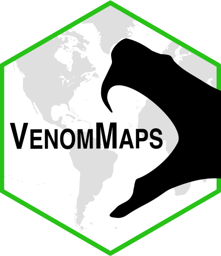
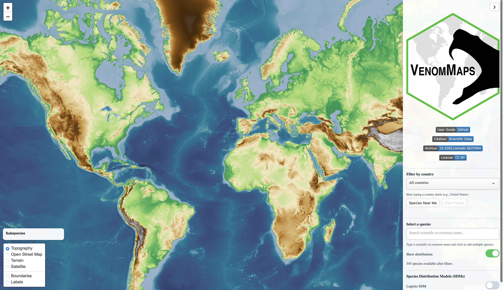
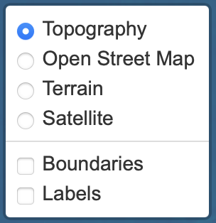
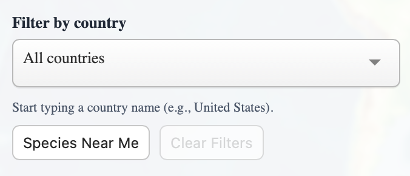
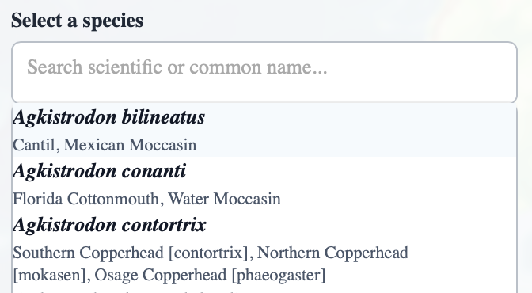
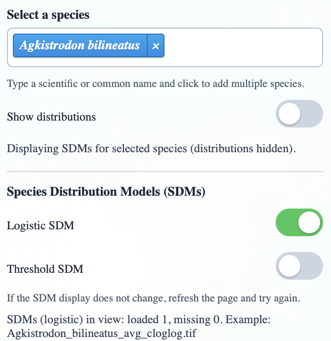
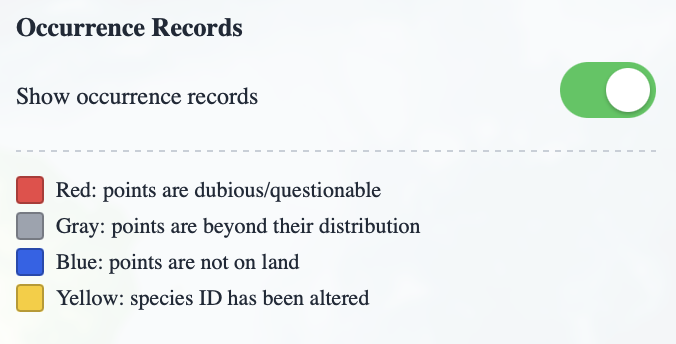
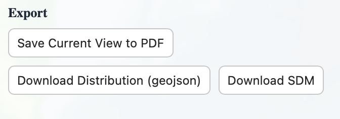

# VenomMaps: Updated Species Distribution Maps and Models for New World Pitvipers (Crotalinae)


### Rhett M. Rautsaw, Gustavo Jiménez-Velázquez, Erich P. Hofmann, Laura R. V. Alencar, Christoph I. Grünwald, Marcio Martins, Paola Carrasco, Tiffany M. Doan, & Christopher L. Parkinson

<br>

[](https://rhettrautsaw.github.io/VenomMaps)
[](https://doi.org/10.1038/s41597-022-01323-4)
[](https://doi.org/10.5281/zenodo.5637094)
[](https://creativecommons.org/licenses/by/4.0/)

# Table of Contents

- Cleaned occurrence records for Viperidae from [GBIF](https://www.gbif.org/), [HerpMapper](https://www.herpmapper.org/), [Bison](https://bison.usgs.gov/), [Brazil Snake Atlas](https://bioone.org/journals/South-American-Journal-of-Herpetology/volume-14/issue-sp1/SAJH-D-19-00120.1/Atlas-of-Brazilian-Snakes--Verified-Point-Locality-Maps-to/10.2994/SAJH-D-19-00120.1.short), [BioWeb Ecuador](https://bioweb.bio/), and custom databases/georeferencing. 
  - [`data/occurrence`](https://github.com/RhettRautsaw/VenomMaps/tree/master/data/occurrence)
- Updated distribution maps in `geojson` format for all New World Pitvipers as well as distribution maps for Old World Vipers from [Roll et al. 2017](https://www.nature.com/articles/s41559-017-0332-2).
  - [`data/distributions`](https://github.com/RhettRautsaw/VenomMaps/tree/master/data/distributions)
- Final species distribution models for all New World pitvipers
  - [`data/sdms`](https://github.com/RhettRautsaw/VenomMaps/tree/master/data/sdms)
- Code used to clean occurrence records, construct distribution maps, and summarize sdm results.
  - [`code/*`](https://github.com/RhettRautsaw/VenomMaps/tree/master/code)
- Code used to construct species distribution models
  - [`code/autokuenm/*`](https://github.com/RhettRautsaw/VenomMaps/tree/master/code/autokuenm)
- [Web App](https://rhettrautsaw.github.io/VenomMaps) to visualize results
  - User Guide found below

# Updates/Changelog
- **2026-03-22**: 
	- Shiny app was updated to support the latest version of R and package dependencies including switching to use `sf` and `terra` instead of `sp` and `raster`. 
	- Shiny app is being deprecated in favor of a new web app built directly with HTML/CSS/JS. This results in significant speed and performance improvements. 
		- The new web app is found in this repository [rhettrautsaw.github.io/VenomMaps](https://rhettrautsaw.github.io/VenomMaps).
		- **PLEASE BOOKMARK THE NEW PAGE BY JULY 2026**

# Web App

You can view VenomMaps at 
[rhettrautsaw.github.io/VenomMaps](https://rhettrautsaw.github.io/VenomMaps)

## User Guide

After opening the app you should see the full-page Leaflet map with the VenomMaps control panel on the right:



<br>

***

<br>

### Basemaps and Overlays



The control in the lower left lets you switch among the available basemaps:

- `Topography`
- `Open Street Map`
- `Terrain`
- `Satellite`

You can also toggle reference overlays for:

- `Boundaries`
- `Labels`

<br>

***

<br>

### Filter by Country or Your Location



Use the `Filter by country` box to limit the species list to taxa that overlap a selected country.  
The `Species Near Me` button uses your browser location to identify species overlapping your current area.  
`Clear Filters` resets both the country and location filters.

<br>

***

<br>

### Select Species



The `Select a species` box supports multiple selections. Search by:

- scientific name
- common name

For example, searches such as `Agkistrodon piscivorus`, `Cottonmouth`, and `Water Moccasin` will all help you find the same taxon when aliases are available.

The dropdown shows scientific names in bold italics, with common names listed underneath.

Once selected, species distributions are drawn on the map and colored by `Subspecies` when that field is present in the GeoJSON:


<br>

***

<br>

### Species Distribution Models (SDMs)



SDMs can be displayed using either:

- `Logistic SDM`
- `Threshold SDM`

Only one SDM type can be active at a time. The `Show distributions` switch can be left on to overlay SDMs with the polygon distribution, or turned off to view SDMs by themselves.

If the SDM display does not update when switching model types, refresh the page and try again.

Example SDM display:


<br>

***

<br>

### Occurrence Records



Use the `Show occurrence records` switch to add cleaned occurrence points for the selected species.  
Occurrence points are colored by `flag`, with the legend shown in the control panel.

Clicking a point displays:

- `ID`
- recorded taxonomy
- updated taxonomy
- coordinate accuracy
- flags

Example occurrence display:


<br>

***

<br>

### Export and Downloads



The `Export` section currently supports:

- `Save Current View to PDF`
- `Download Distribution (geojson)`
- `Download SDM`

The PDF export is formatted to print the map view with the legend and VenomMaps logo, without the input panel.

Example exported map view:


<br>

***

<br>

# Shiny App (deprecated)

## Running the Application Locally

This app can also be run through R:

```R
library(shiny)

# Easiest way is to use runGitHub
runGitHub("VenomMaps", "RhettRautsaw")

# Run a tar or zip file directly
runUrl("https://github.com/RhettRautsaw/VenomMaps/archive/master.tar.gz")
runUrl("https://github.com/RhettRautsaw/VenomMaps/archive/master.zip")
```

To run a Shiny app from a subdirectory in the repo or zip file, you can use the `subdir` argument. This repository happens to contain another copy of the app in `inst/shinyapp/`.

```R
runGitHub("VenomMaps", "RhettRautsaw", subdir = "inst/shinyapp/")

runUrl("https://github.com/RhettRautsaw/VenomMaps/archive/master.tar.gz",
  subdir = "inst/shinyapp/")
```

## Download the Data

You can clone this GitHub repository to run the Shiny App or to download all the `geojson` files.

```R
# First clone the repository with git. If you have cloned it into
# ~/VenomMaps, first go to that directory, then use runApp().
setwd("~/VenomMaps")
runApp()
```

# Todo List (Additions)

- Update distribution maps for Old World Vipers and other venomous snake species.
- Add phylogeographic tracing/playback
- Venom Information
- Diet Information
