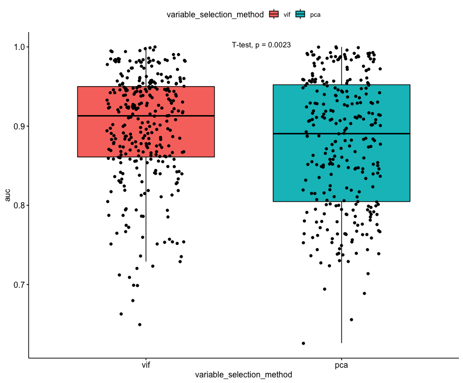

# Variable Selection Methodology

I ran a couple tests to try and identify the best methodology for selecting environmental variables and removing colinearity. According to [Cobos et al. (2019)](https://www.sciencedirect.com/science/article/abs/pii/S1574954119301025) the best methodology is an exhaustive search through all combinations of environmental variables, but this is often computationally unfeasible. Therefore, I tested two methods:

## PCA Method
1. Calculate colinearity across all variables
2. Randomly keep one variable within each group with colinearity greater than 75%
3. Run PCA with remaining variables
4. Only keep variables with PCA contributions greater than 5%.

## VIF/Maxent Method
1. Run Maxent with all variables using default settings with dismo
2. Remove any variables with 0 permutation importance
3. Calculated Variable Inflation Factors (VIF) for remaining variables
4. Select the two variables with the highest VIF values and remove whichever has the lower permutation importance
5. Recalculate VIF and repeat Step 4 until all variables have VIF less than 10
6. Re-run Maxent with remaining variables
7. Remove variables with permutation importance less than 1%

# Results

I tested these two methods on 109 species of New World pitvipers (Viperidae: Crotalinae) using three different sets of environmental data:

1. bioclim
2. EarthEnv topography
3. EarthEnv landcover

My findings suggest that the VIF/Maxent method results in significantly higher AUC in the final model selection. 

